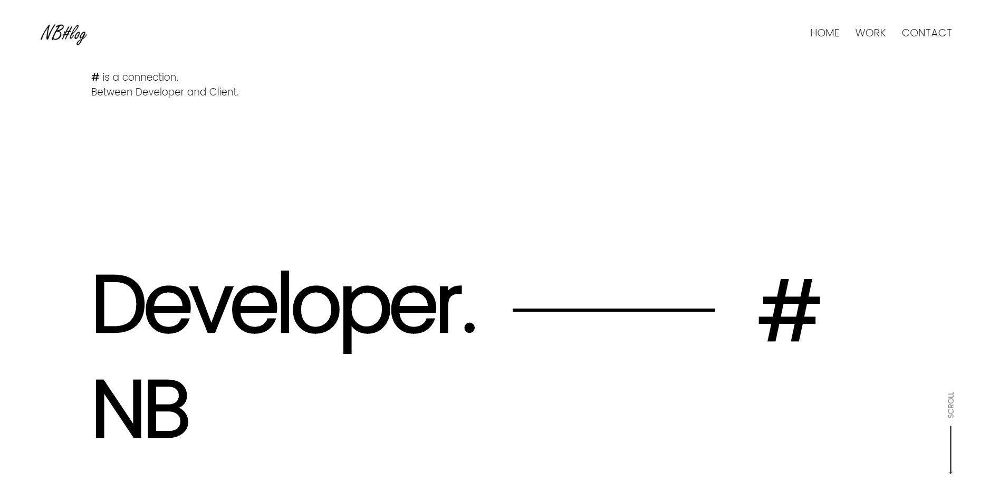

# NB

> NB's Portpolio Web Site



## About

My Portfolio Web site remodeling using Vue.js and Node.js.


## Stack

#### Front-end

- Vue.js
- CSS Module + SCSS

#### Server

- Node.js
- ClearDB(MySQL)
- Heroku Web Hosting


## Build Setup

#### Client-Side

``` bash
# Go Client
cd client

# install dependencies
npm install

# serve with hot reload at localhost:8080
npm run dev

# build for production with minification
npm run build
```

#### Server-Side

```bash
# Go Server
cd server

# install dependencies
npm install

# serve with hot reload at localhost:80
npm start
```


#### Questions

Feel free to submit new issue when you have questions or find some bugs.
